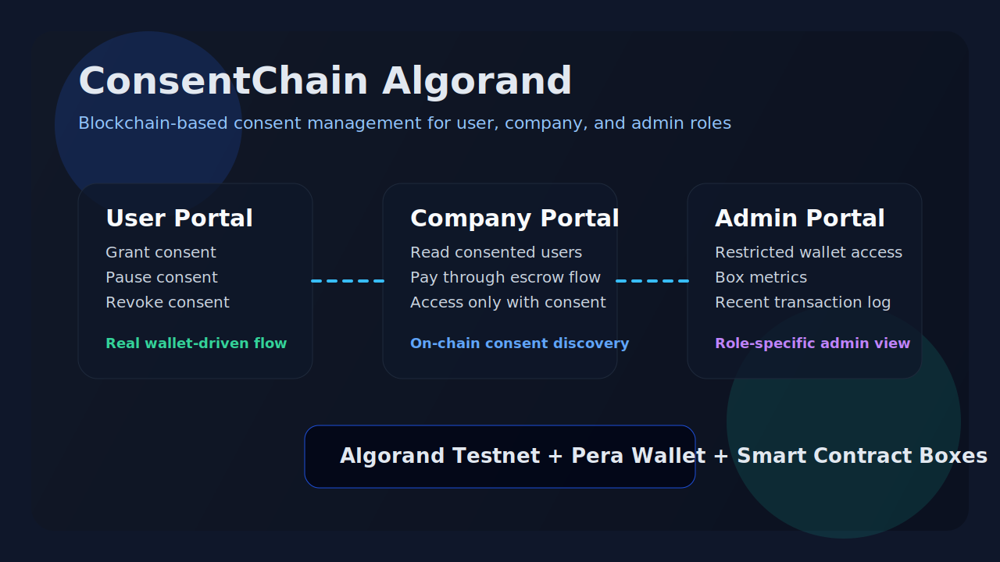
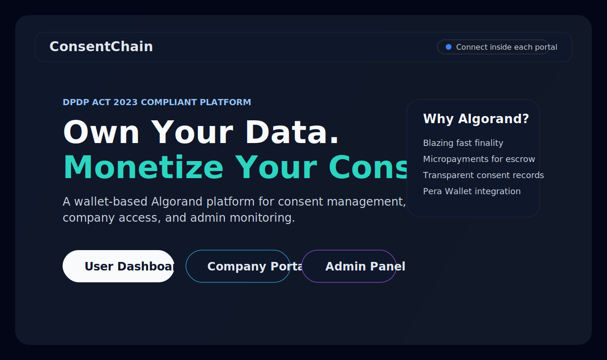
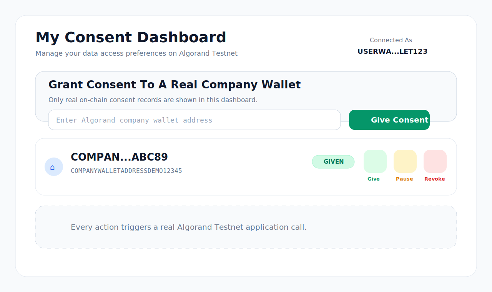
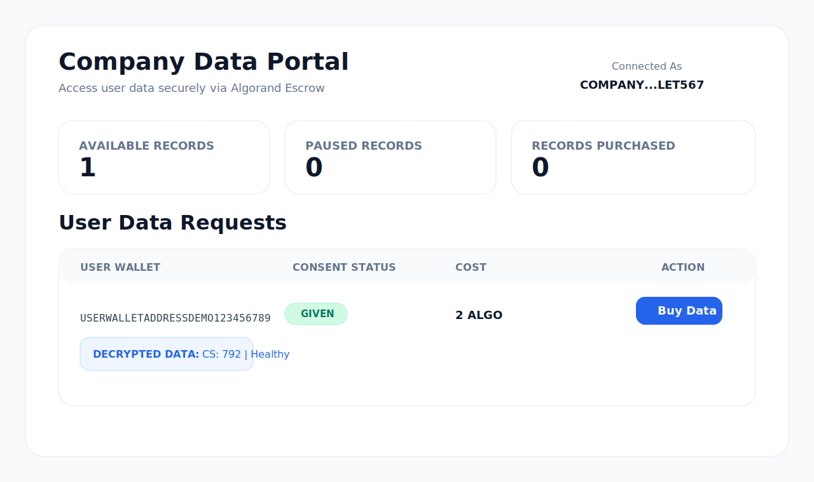
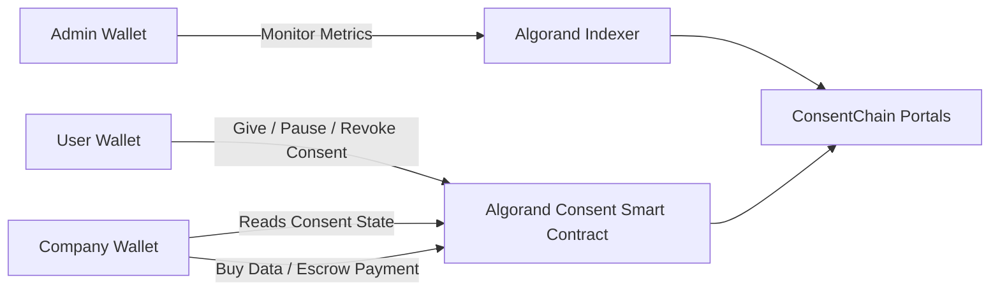

# ConsentChain Algorand

ConsentChain Algorand is a blockchain-based consent management platform built on Algorand for DPDP Act 2023 style data-consent workflows. It gives users a clear way to grant, pause, and revoke consent, lets companies request access through a wallet-driven flow, and provides an admin view for monitoring platform activity.

This repository is designed for demos, hackathons, and portfolio review. The current app uses separate User, Company, and Admin portals, real Algorand Testnet wallets, and on-chain consent records instead of mock consent lists.



## Why This Project Matters

Digital consent systems are often opaque, centralized, and hard for users to verify. ConsentChain Algorand explores a different model:

- Users control who can access their data
- Companies must rely on explicit consent status
- Consent state is auditable on-chain
- Access can be paired with escrow-style payment logic
- Admin monitoring is separated from user and company roles

## Core Features

- Real wallet-based role separation for User, Company, and Admin flows
- Consent actions on Algorand Testnet: `Give`, `Pause`, and `Revoke`
- On-chain consent discovery from Algorand application box storage
- Company portal that only surfaces users who actually granted consent to that company wallet
- Admin portal restricted to an approved admin wallet address
- Pera Wallet integration for connection and transaction signing
- Next.js frontend, Express backend, and Algorand smart contract architecture

## Demo Roles

The app is easiest to demonstrate with three Algorand Testnet wallets:

- `User Wallet`
  Grants, pauses, or revokes consent
- `Company Wallet`
  Views real consented users and initiates the data purchase flow
- `Admin Wallet`
  Views platform metrics and recent application activity

## Screenshots And Demo Assets

This repository includes a preview asset for GitHub and project sharing:

- [ConsentChain overview graphic](docs/screenshots/consentchain-overview.svg)
- [Homepage preview](docs/screenshots/homepage-preview.svg)
- [User dashboard preview](docs/screenshots/user-dashboard-preview.svg)
- [Company portal preview](docs/screenshots/company-portal-preview.svg)

### Homepage



### User Dashboard



### Company Portal



## How The Flow Works



## What Makes This Repo Different

- The user and company dashboards now read real on-chain consent relationships
- The portals use wallet-specific entry flows instead of a single shared homepage connection
- The admin panel is restricted to an approved wallet and masks the displayed admin address in the UI
- The homepage opens each portal in a separate tab, which makes role-based demos cleaner

## Project Structure

- [`frontend`](frontend): Next.js application for the User, Company, and Admin portals
- [`backend`](backend): Express API that verifies consent state before releasing protected data
- [`contracts`](contracts): Algorand smart contract project and generated client artifacts
- [`docs/screenshots`](docs/screenshots): repository preview assets and future screenshot location

## Tech Stack

- Frontend: Next.js App Router, React, Tailwind CSS, Lucide React
- Wallet: Pera Wallet via `@txnlab/use-wallet-react`
- Backend: Node.js, Express, `algosdk`
- Blockchain: Algorand Testnet, AlgoKit, PuyaTS
- Data Access Logic: on-chain consent verification plus backend-controlled release

## Local Development

### Prerequisites

- Node.js 18+
- Docker
- [AlgoKit CLI](https://github.com/algorandfoundation/algokit-cli)
- Pera Wallet configured for Algorand Testnet

### 1. Start Algorand LocalNet

```bash
algokit localnet start
```

### 2. Build And Deploy The Smart Contract

```bash
cd contracts/consentchain-algorand
npm install
npm run build
npm run deploy
```

### 3. Start The Backend

```bash
cd backend
npm install
npm start
```

Default backend port: `5000`

### 4. Start The Frontend

```bash
cd frontend
npm install
npm run dev
```

Default frontend port: `3000`

## Future Improvements

- Better screenshot gallery in the README
- Custom company metadata instead of address-only display
- Stronger production-grade role management
- Expanded off-chain data release workflows

## License

This project is licensed under the terms in [LICENSE](LICENSE).

Built for data sovereignty on Algorand.
